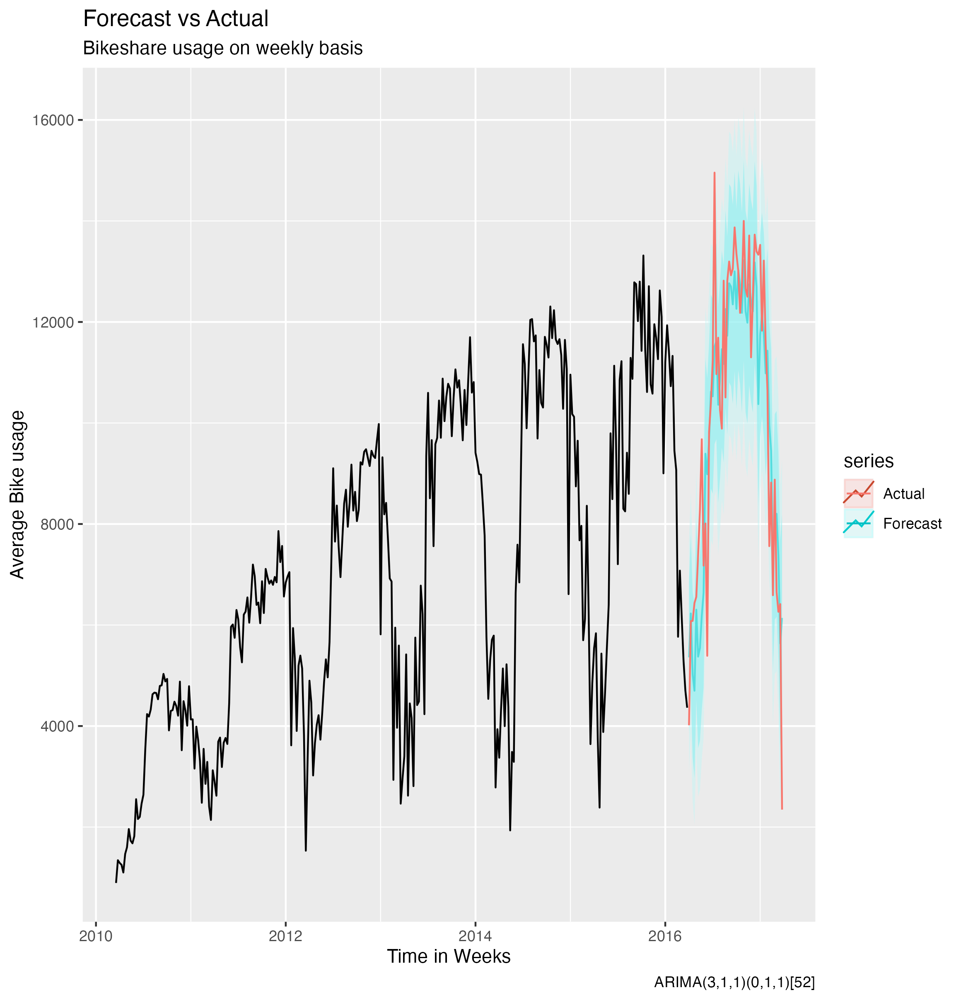

# Code

All our code has been split into two sub folders.

## EDA

This folder contains all the models that were used during exploratory data analysis.

The two main files that reviewed the data were `EDA_plots.R` and `EDA.R`.

The file `EDA_plots.R` explores the data through plotting both daily and hourly.

## Models

This folder contains all the models that were used to forecast the outcome.

For the most part, the `Combinedmodels` files contain the combination of all the data from the other files. This allows a single place to review how each of the models stack up against one another.

### Regression Models

We have run regression models to try and predict bike usage. These models can be seen both in the `Combinedmodels` files as well as `regression_models.R`

The different models used: - Decision Trees - Random Forest - LightGBM - Linear Regression - LASSO

### Time Series Models

{width="300"}

All the time series models were built and tested in `time_series_models.R` as well as the folders `Prophet attempt` and `SARIMA attemp`. The best model was added to `Combinedmodels`, which was `ARIMA`. The models were also run using weekly data. Weekly was determined by taking the mean of the week of data. This allows for cleaner plots and helps to smooth over possible outliers.

The different models that were run were:

-   ARIMA
-   As well as variants
-   Holt-Winters
-   Time Series Linear Regression
-   Exponential Smoothing

## Packages Used

-   library(lightgbm)
-   library(tidyverse)
-   library(ggplot2)
-   library(fpp2)
-   library(dplyr)
-   library(caret)
-   library(randomForest)
-   library(xgboost)
-   library(data.table)
-   library(glmnet)
-   library(lubridate)
-   library(tidymodels)
-   library(rpart)
