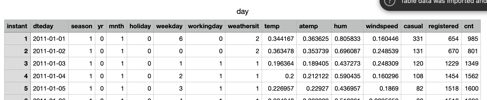
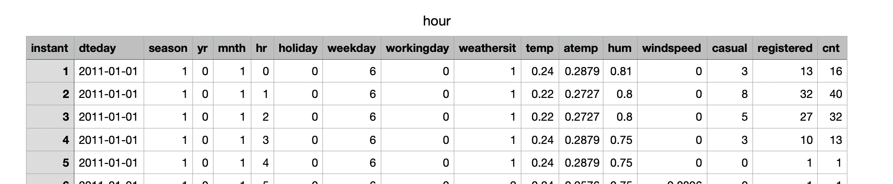

# MGT 6203 Group Project Proposal Template

Please edit the following template to record your responses and provide details on your project plan. 

# TEAM INFORMATION (1 point)

Team #: 10
Team Members: 

[Insert background information: Name, professional background, education background, previous 	analytics related projects you have worked on]

* Eric Loui, GT ID 903955593. Over a decade of experience in cybersecurity as a cyber threat intelligence analyst and teamlead. Currently a Principal Intelligence Analyst at CrowdStrike. Dayjob involves basic python scripting to automate workflows and data analysis. Occasionally I have experimented with doing basic K-means or linear regression on cybersecurity datasets. I regularly write reports and have in the past made many presentations to communicate findings of research and analysis. Formal education: BA, Political Science, Swarthmore College (2009); MA, International Affairs, American University (2013); Professional Certificate, Data Science, Cal State Fullerton (2021).

* Daniel Garrison, GT ID 903935213. I graduated December 2022 with a Bachelor of Science in Applied and Computational Mathematics from Kennesaw State University. After graduation, I began employment at Morgan Stanley, and I am in the process of transitioning to a portfolio manager position. I mainly use excel at work; however, I am well-versed in both python and R because of my academic background. I've taken courses in bayesian statistics and regression analysis, and I am proficient in discrete math and linear algebra. My senior year I did research on modeling the movement of C. Elegans (nematodes) using partial differential equations in python.

* Joshua Blakely, GT ID 903745052. Over a decade of experience working as a mechanical engineer in the oil and gas industry. I have worked for AWS forecasting their EC2, EBS and S3 usage down to the component level. I currently work as a Quantitative Data Scientist for a hedging advisory firm. I have worked with Python and R through both work and education. I am a TA for Bayesian Statistics. Education: BS Mechanical Engineering.

* Umair Zakir Abowath, GT ID 903845079. I have a bachelors in electrical engineering and have been working as a Data Scientist for over four years. I have an experience in bayesian statistics, Machine learning and Artificial Intelligence in general.

* Adam Peir,  GT ID 903054541. I am currently a data analyst for the federal government, where I specialize in areas of mail theft, narcotics, and finacial fraud. I received my BS in mechanical engineering from the University of Texas. I am comfortable with python, R, and SQL. 

# OBJECTIVE/PROBLEM (5 points)

#### Project Title: 

#### Background Information on chosen project topic: 
Bikesharing systems are an increasingly popular solution in major urban areas to increase trips taken by bike, which can help people get around without cars, thus improving the lives of both users, as well as non-users, as each bike trip potentially represents a trip that would otherwise have required a car. We hope to use data from the DC Capital Bikeshare in 2011 and 2012 to predict bikeshare usage system-wide.

### Problem Statement (clear and concise statement explaining purpose of your analysis and investigation): 
The purpose of this analysis is to determine variables/factors that help estimate bikeshare useage and develop a model that predicts bikeshare useage based on certain predictor variables.

### State your Primary Research Question (RQ): 
Using the predictor variables available in our dataset, can we predict bikeshare usage over time?

#### Add some possible Supporting Research Questions (2-4 RQs that support problem statement): 
* What are the main factors influencing bikesharing rates?
* How sensitive is bikesharing to the influencing factors?

### Business Justification: 
(Why is this problem interesting to solve from a business viewpoint? Try to quantify the financial, marketing or operational aspects and implications of this problem, as if you were running a company, non-profit organization, city or government that is encountering this problem.)

Increasing the fraction of trips taken by bike is beneficial to urban planners, as it reduces traffic and consequent pollution on local roads, and helps people get exercise. We want to help future bikeshare programs be able to predict demand, in order to make sure their own bikeshare programs are resourced well for peak times and days. Additionally, knowing when demand is likely to be low is also beneficial, as this helps planners know when to temporarily take bikes or docks out of commission for maintenance or upgrades with minimal impact to users.

# DATASET/PLAN FOR DATA (4 points)
## Data Sources (links, attachments, etc.): 
https://archive.ics.uci.edu/dataset/275/bike+sharing+dataset 

2011 and 2012 historical usage data from Washington, DC’s public Capital Bikeshare program, one of the first large scale bikeshare programs in the nation.

Data Description (describe each of your data sources, include screenshots of a few rows of data): 
* hour.csv : bike sharing counts aggregated on hourly basis. Records: 17379 hours
* day.csv - bike sharing counts aggregated on daily basis. Records: 731 days
* Both hour.csv and day.csv have the following fields, except hr which is not available in day.csv
    
    - instant: record index
    - dteday : date
    - season : season (1:springer, 2:summer, 3:fall, 4:winter)
    - yr : year (0: 2011, 1:2012)
    - mnth : month ( 1 to 12)
    - hr : hour (0 to 23)
    - holiday : weather day is holiday or not (extracted from http://dchr.dc.gov/page/holiday-schedule)
    - weekday : day of the week
    - workingday : if day is neither weekend nor holiday is 1, otherwise is 0.
    + weathersit :
   	 - 1: Clear, Few clouds, Partly cloudy, Partly cloudy
   	 - 2: Mist + Cloudy, Mist + Broken clouds, Mist + Few clouds, Mist
   	 - 3: Light Snow, Light Rain + Thunderstorm + Scattered clouds, Light Rain + Scattered clouds
   	 - 4: Heavy Rain + Ice Pallets + Thunderstorm + Mist, Snow + Fog
    - temp : Normalized temperature in Celsius. The values are divided to 41 (max)
    - atemp: Normalized feeling temperature in Celsius. The values are divided to 50 (max)
    - hum: Normalized humidity. The values are divided to 100 (max)
    - windspeed: Normalized wind speed. The values are divided to 67 (max)
    - casual: count of casual users
    - registered: count of registered users
    - cnt: count of total rental bikes including both casual and registered

### Key Variables: (which ones will be considered independent and dependent? Are you going to create new variables? What variables do you hypothesize beforehand to be most important?)
* The dependent variables will likely be one or more of: casual, registered, cnt - since we want to predict usage
* The independent variables will likely be some combination of all the other variables.

# APPROACH/METHODOLOGY (8 points)
## Planned Approach 
(In paragraph(s), describe the approach you will take and what are the models you will try to use? Mention any data transformations that would need to happen. How do you plan to compare your models? How do you plan to train and optimize your model hyper-parameters?)

First, we use multiple linear regression to create different models. This gives an idea of the statistical significance of each variable. Next, we conduct partial F-tests and analyze the correlation coefficients between variables to find the variables with greatest explanatory power. Finally, we perform an ANOVA analysis to discover if there are differences in bikesharing between the casual and registered populations.

## Anticipated Conclusions/Hypothesis 
(what results do you expect, how will you approach lead you to determining the final conclusion of your analysis) Note: At the end of the project, you do not have to be correct or have acceptable accuracy, the purpose is to walk us through an analysis that gives the reader insight into the conclusion regarding your objective/problem statement

We expect to find that there are strong seasonality patterns in the data, both in terms of day of the week, as well as the week/month of the year. We expect higher usage during weekends, and during tourist seasons in DC.

We also expect weather will influence usage - that users are more likely to use the system when there is no precipitation, and when the weather is warm.

### What business decisions will be impacted by the results of your analysis? What could be some benefits?
Our findings would influence planning for when to add more bikes to a system as well as when it is safer to take some bikes out of commission for maintenance or upgrades. Additionally, ridership projections can also help inform revenue projections, since some riders pay per-ride.

# PROJECT TIMELINE/PLANNING (2 points)
## Project Timeline/Mention key dates you hope to achieve certain milestones by:

Progress report finished and submitted by November 2nd (due November 4th).
Final report finished and submitted by December 1st (due December 3rd).

## Appendix (any preliminary figures or charts that you would like to include): 
